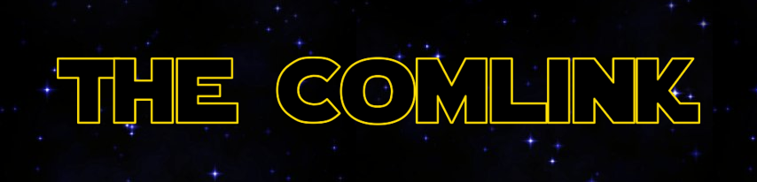

A long time ago in a galaxy far far away, the arma 3 community created the 501st unit. Along with their fellow GARC units, they created a proud community of star wars simulator fans. The Comlink is a place where the clones can converse with each other and share images/videos from their antics. 

 

---

## **Contents**

- [Basics](#Basic)
    - [Naming](#naming)
    - [User Stories](#user-stories)
    - [User Stories: Criteria](#user-stories-criteria)
    - [User Stories: Issues](#user-stories-isssues)
- [User Design](#user-design)
    - [Wireframes](#wireframes)
    - [Colour Scheme](#Colour-scheme)
    - [Typography](#Typography)
    - [Imagery](#Imagery)
- [Page Features](#page-features)
    - [Main Content](#main-content)
        - 
    - [Footer](#footer)
- [Responsivity](#responsivity)
    - [Mobile Layout](#mobile-layout)
    - [Tablet Layout](#tablet-layout)
- [Future Features](#future-features)
    - [Future Changes](#future-changes)
- [Testing](#testing)
    - [Lighthouse Scores](#lighthouse) 
    - [HTML Validation](#html-validation)
    - [CSS Validation](#css-validation)
- [Deployment](#deployment)
- [Credits](#credits)
--- 

## Basics

### Naming
To begin with, I was uncertain what to call this social media site as I wanted it to relate to Star wars and the community. While thinking about quotes from the films i realised that there could only be one name - Comlink. This is the device usedd across the galaxy to communicate to one another and so this fits perfectly with the idea and theme of the service.
### User Stories 
Since creating user stories is a weak point for me, I decided to have Microsoft Copilot help me out.

### User Stories: Criteria
The majority of the provided user stories fit very well and so I asked Copilot to create the criteria for each.
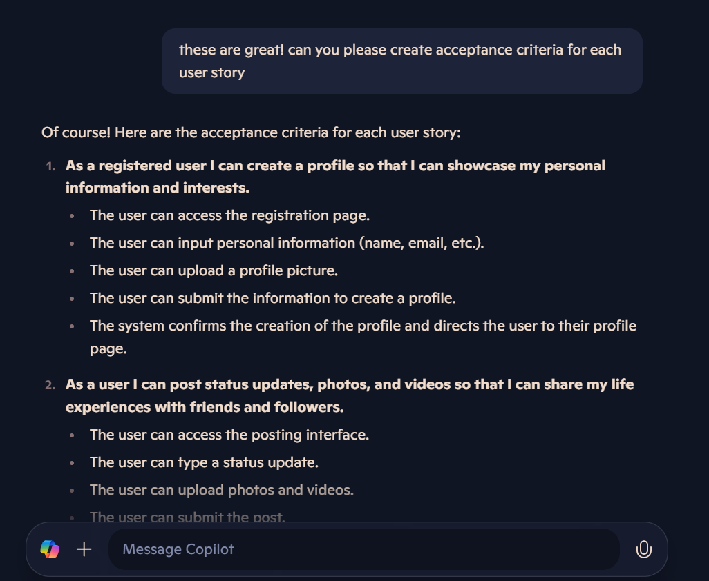
### User Stories: Isssues
From what Copilot provided me, I tweaked the wording of some of them and then added them to the issues section od GitHub. I created a user story template to do this much faster.

Once the issues were made, I added them to my project board and assigned them labels for their priority.

## User Design
Since this site is heavily influenced by Star Wars, I wanted to keep the styling similar to the main colours used for their graphics - this is where the black and yellow come from on the pallete.

### Wireframes
I drew up the wireframes using sketchbook - a drawing app that I use. The layout is simple so that the site can be easy to use. I only drew how the profile page will change on tablet and pc screens as the main feed page will just look the same only bigger.
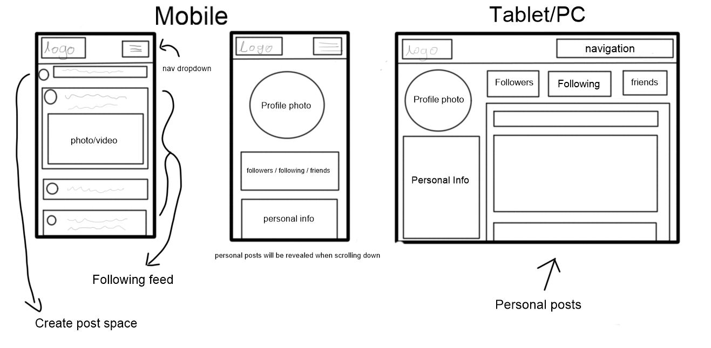

### Colour Scheme

Since this site is aimed for the 501st unit (which I am a part of) I wanted to include more colours that connect to the unit specifically. For those that know Star Wars, they will know that their colours are blue (on top of the clone trooper white). For those that don't - here is a photo of the 501st Commander, Rex, to show his colours:

and here is a snippet from the offical Star Wars wiki page:

Using this photo and some research the closest blue I could link was French blue (hex code: #0072BB) and so, combining all the colours together I created this pallete using Coolors.

While planning I wasn't 100% certain how many colours I would need and so, keeping on the Star wars theme, I went to get more colours - just in case. (From the future: these colours did come in handy)

### Typography 
As much as I would have loved to use the Star Wars offical font - I opted to choose an easier to read and more relaxed looking set of fonts. I tried to keep with the galactic theme and so looked for quite robotic and sharp fonts. I settled on:
#### Header: Orbitron

#### Body: Montserrat

### Images
Since this site it so be used as a type of social media any images used in the main site will be provided by it's users, this inclludes the feed page and the profile page. The only images used on the site is the logo which was made using [Font Meme](https://fontmeme.com/star-wars-font/):

and the background image found on [Pintrest](https://uk.pinterest.com/pin/404057397815645775/):
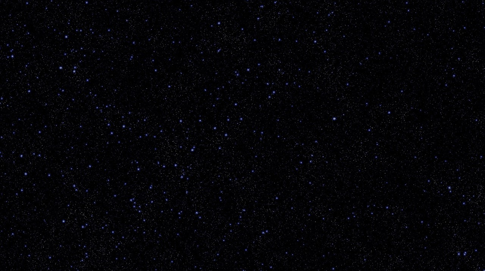
## Page Features

### Main Content
The main content of the site will be provided by its users, this will be the feed page. This is how it could look once populated:
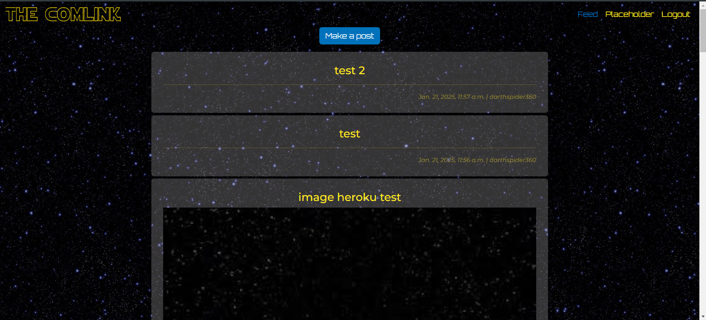

#### Comments
As part of the MVP of the project, users need to be able to interact with the posts - creating comments, editing and deleting them. Using example comments this is how they are presented:
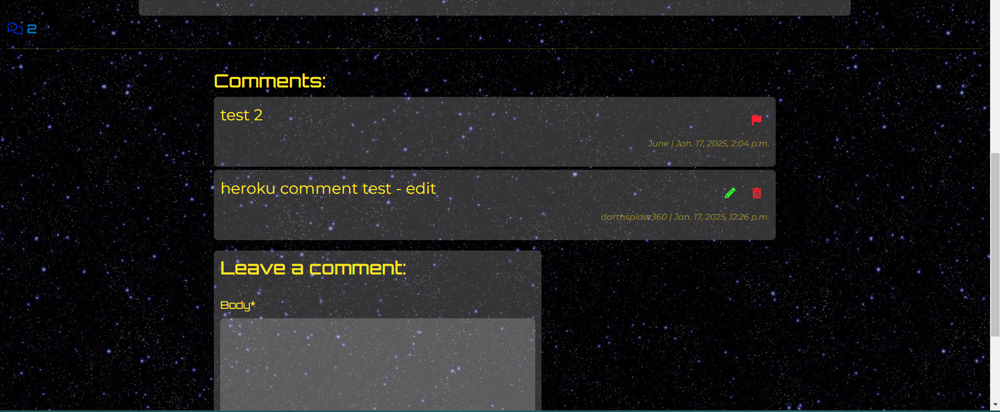

### Signing in/out/up
Since I'm using allauth for my accounts I had to go in and add styling to their provided pages. As you can see, this is where the lightsaber colours came in handy as I could add glow to represent each section of signing in.out/up. This is how they look:
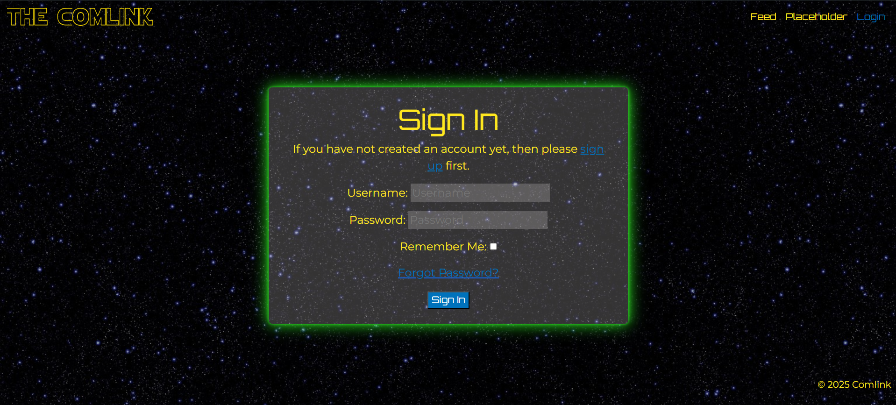
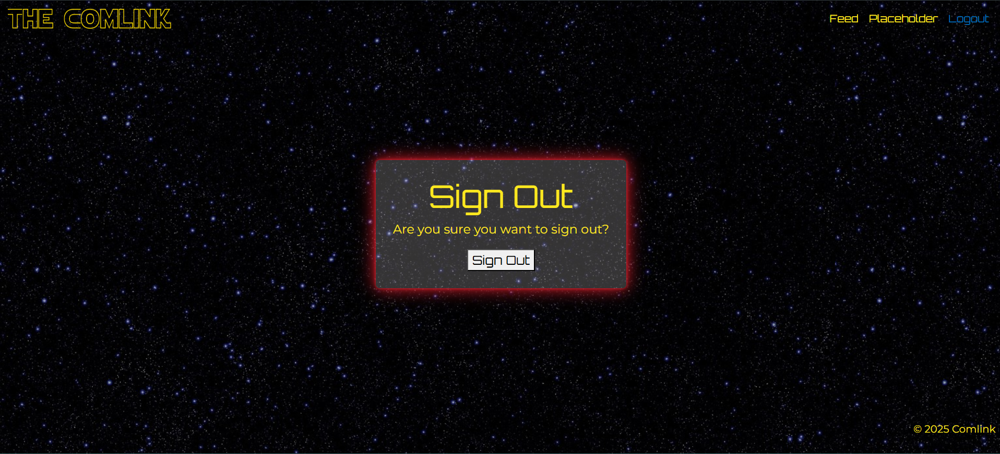
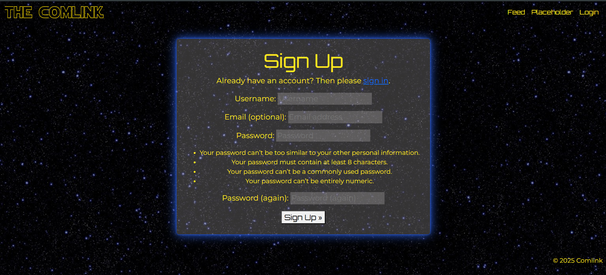

Due to using allauth I have to used Devtools to allow me to find the ID of certain area's of their forms to perfect the styling to match the rest of the site - changing the form field backgrounds from solid white. Amy helped me with learning how to do this.
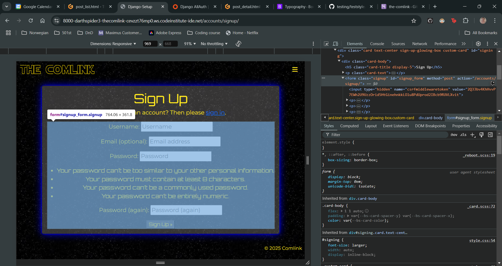
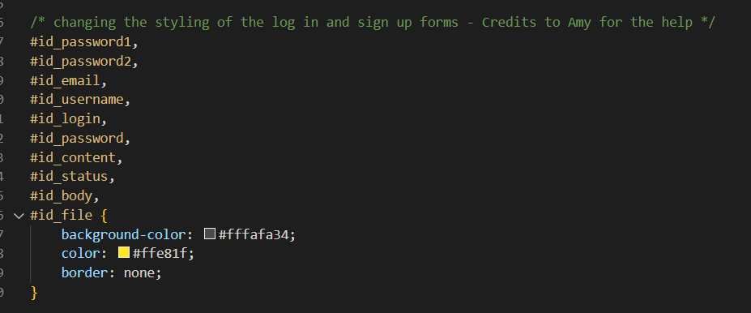
### Footer
While I do have a footer, it only provides minimal information so not to distract from the main page.

## Responsivity 
To make sure that the site was responsive across all devices I built it mobile first as this is most likely where people in a crisis will access the site.

### Mobile Layout

### Tablet Layout

## Future Features

### Future Changes

## Testing

### LightHouse

### HTML Validation

### CSS Validation

## Deployment
I deployed my site using github and github pages. These are the steps I did:

1. Logged into my GitHub account
2. Went to the BandAid repository
3. Click the Settings button near the top of the page
4. In the left-hand menu I navigated to the Pages button
5. In the Source section I chose 'main' from the drop-down
6. I selected 'root' from the drop-down folder menu in branch menu
7. I saved adn then waited a short while for the link to be generated.

## Credits
- Amy for the README Layout idea
- Copilot for user stories and coding support
- HTML & CSS Validator
- Devtools Lighthouse
- AutoPrifix
- Mugs of tea and bacon sandwiches for moral support
- Cans of Monster for energy (order: 66)