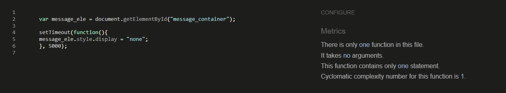
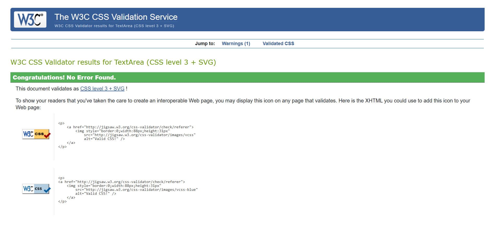
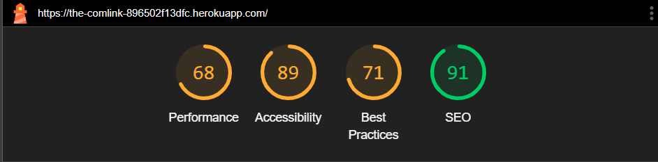
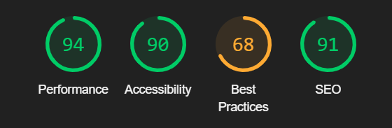
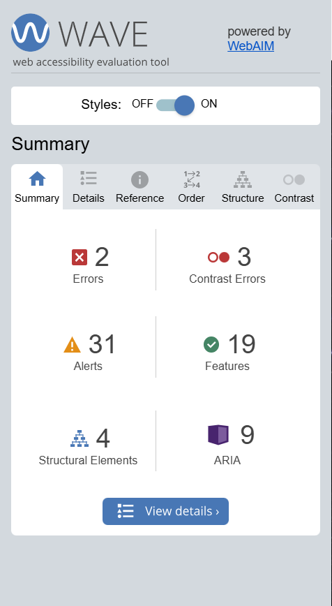

# Testing

This is the TESTING file for [Comlink](#) website.

Return back to the [README.md](README.md) file.
---

## **Contents**

- [Testing](#testing)
  - [Validation](#validation)
    - [HTML Validation](#html-validation)
    - [JavaScript Validation](#javascript-validation)
    - [Python Validation](#python-validation)
    - [CSS Validation](#css-validation)
    - [Lighthouse Scores](#lighthouse-validation)
    - [Wave Validation](#wave-validation)
  - [Manual Testing](#manual-testing)
    - [User Input/Form Validation](#user-inputform-validation)
    - [Dev Tools/Real World Device Testing](#dev-toolsreal-world-device-testing)
  - [Known Bugs](#known-bugs)
---

## Validation

### HTML Validation

For my HTML files I have used [HTML W3C Validator](https://validator.w3.org) to validate all of my HTML files.

I have had to follow a different approach for validating my HTML for this project as the majority of my pages are developed using Jinja syntax such as '' and '{{ form|crispy }}' and most require user authentication. The HTML validator will throw errors if I were to use my website's URL so I have had to follow the below approach for every page:

- Via the deployed Heroku app link, I have navigated to each individual page.
- Right clicking on the screen/CTRL+U/⌘+U on Mac, allows a menu to appear, giving me the option to 'View page source'.
- The complete HTML code for the deployed page will appear, allowing you to select the entire code using CTRL+A/⌘+A on Mac.
- Paste the copied code into the [validate by input](https://validator.w3.org/#validate_by_input) option.
- Check for errors and warnings, fix any issues, revalidate by following the above steps and record the results.

| HTML Source Code/Page | Errors | Warnings |
| ---- | ------ | -------- | 
| Home/Feed | 0 | 0 |
| Sign In | 0 | 0 |
| Sign Up | 4 | 0 |
| Sign out | 0 | 0 |
| Profile Page | 0 | 0 |
| Edit Profile | 0 | 0 |
| Add Post | 0 | 0 |
| View Post | 0 | 0 |
| Error 404 | 0 | 0 |

The 4 errors in the Sign up section are due to the AllAuth forms that I cant edit as it is behind
`
{{ form.as_p }}
`
I do however find this interesting and the other AllAuth forms didn't cause an error, I think I need more knowledge to be able to fix this.

### JavaScript Validation
Since the comment.js file was taken from the Code institute Djgango walkthrough 'Code Star' I didnt test this file, however i did include a small amount of js in the Base.html to allow the pop up messages to fade after a few seconds and so I validated this using [JSHint](https://jshint.com/):

### Python Validation
I used [CI python](https://pep8ci.herokuapp.com/#) for my python validation - checking the files i wrote and changed.

| App Name | admin.py | forms.py | models.py | urls.py | views.py |
|----|----|----|----|----|----|
| Comlink(main project)| na | na | na | [no errors](media/readme-images/comlink-app-python.png) | na |
| Feed | [no errors](media/readme-images/feed-admin-python.png) | [no errors](media/readme-images/feed-forms-python.png) | [no errors](media/readme-images/feed-models-python.png) | [no errors](media/readme-images/feed-urls-python.png) | [no errors](media/readme-images/feed-views-python.png) |
| Profile Page | [no errors](media/readme-images/profile-admin-python.png) | [no errors](media/readme-images/profile-forms-python.png) | [no errors](media/readme-images/profile-models-python.png) | [no errors](media/readme-images/profile-urls-python.png) | [no errors](media/readme-images/profile-views-python.png) |

### CSS Validation
To make sure that the CSS was validated correctly, I fetched the CSS from the page source - using the copied styling in the direct input at [W3C CSS Vadlidator](https://jigsaw.w3.org/css-validator/#validate_by_input). The only warning I recieved was because of using Bootstrap styling alongisde my own.

### Lighthouse Validation

Lighthouse testing was carried out in Incognito mode to acheive the best result. Performance was lower than preferred due to the site being image heavy. This is some to look at further in development as its mainly caused by user inputted images - perhaps look into converting image files on upload. There was also a few issues with lack of contrast, mainly base on the meta data for the posts - perhaps a future discussion on colour change.

Feed page results:

Post view page results:

Profile page results:

### Wave Validation

I was quiet surprise as I continued to check wave that there wasnt more errors due to the site being heavily made by users - i expected more errors with user uploaded errors but the only 2 that are on WAVE is some of the first picture I uploaded when testing before having fully implimented accessibility. The contrast errors related to the yellow colouring on some of th elinks and footer due to the font weight being thin - perhaps a future discussion.

## Manual Testing

Since my site is user input based, the best way for me to test the site was to hand out the link and have friends and family, colleagues and tutors play around with the site - this is why there is so many random posts and comments. The posts also follow the development of the site as it was built. I comunicated with those testing the site for any changes and placements of icons they believe was the best place.

### User Input/Form Validation
Testing was carried out on desktop using a Chrome browser to ensure all forms take the intended input and process the input appropriately.

| Feature                    | Tested?  | User Input Required | User Feedback Provided     | Pass/Fail | Fix/comments |
|----------------------------|----------|---------------------|----------------------------|-----------|-----|
| Navbar Logo and Icons | Yes | Click | Logo takes user to 'Home', nav options take the user around the site and back to 'home' or 'feed' | Pass | - |
| Feed Page Hover color text | Yes | Hover | Users can hover over posts which causes a hover style to imply they're clickable | Pass | this could be adjusted for only image posts |
| Sign Up Page               | Yes      | Username/Password | Empty fields deliver prompt to user, username/password too similar, password too short | Pass | shoulds remove email field when able as its not needed |
| Sign In | Yes | Username and Password | Username/Password must be exactly as registered originally in either lowercase/uppercase or mixture | Pass | - |
| Edit Profile (Registered User) | Yes | User can replace the placeholder image for Profile Image along with other fields. | No feedback needed as placeholder profile picture is provided as default, user may change it they wish, other fields optional. | Pass | - |
| Add Post (Registered User) | Yes | Mixture of required image/text fields | Due to allowing either text, image or both posts there is no required fields - this however means that an empty post could be made (a known bug) | Pass | try to create a and/or function for post fields |
| Comment Box (Registered User) | Yes | Text input accepted | User is informed that their comment is posted both my a pop up and instantly visable | Pass | - |
| Edit Comment (Registered, Author) | Yes | Text fields | Changes made to comment are saved and displayed | Pass | - |
| Delete Comment (Registered, Author) | Yes | Click button to choose 'Confirm' or 'Close' | Comment is deleted or user returns to main page view | Pass | - |
| Sign Out (Registered User) | Yes | Click to choose 'Sign out' | User is signed out and informed by message on screen. Can move away from this by using the navbar | Pass | - |
| Footer icon | Yes | Click | Icon take user to intended location via a new tab | Pass | - |

### Dev Tools/Real World Device Testing
Responsiveness testing was carried out using Google Dev Tools on several of the provided devices. Responsiveness was evident on all features throughout all tested devices but with a few issues when it came to form responsiveness due to the use of crispy forms. Possiblity that forms need to be made my hand to change this.

## Known Bugs
Some knows bugs include:
- Report function not working and goes to 404 (done intentionally)
- Posts can be made that contain nothing - form fields need a check function
- the current avatar name isnt show when changing the avatar
- image posts displayed on profile arent corretcly responsive

Some of these bug could be fixed with more knowledge in Django frameword and JS
